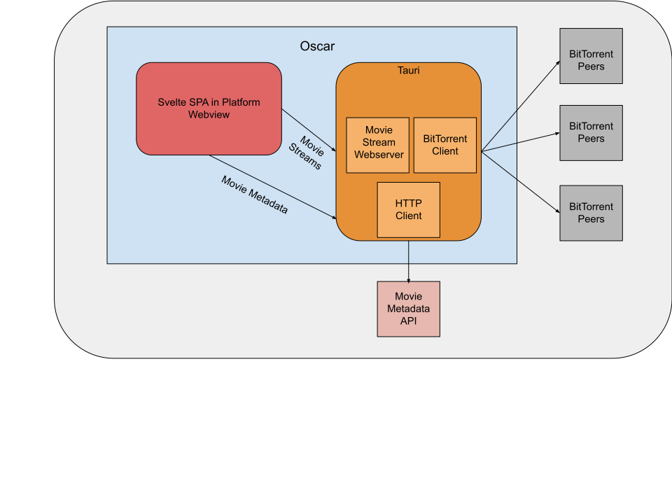

# Oscar

Oscar is a modern, movie-streaming BitTorrent client compatible with all desktop platforms. Oscar's frontend is built with Typescript and Svelte, while the "backend" is built with Rust and [Tauri](https://github.com/tauri-apps/tauri). Tauri is a newer alternative to [Electron](https://www.electronjs.org/) that enables native apps with a lower memory footprint and bundle size. Tauri leverages dynamic-linking of platform-specific Webviews, rather than shipping a Chromium instance with each app.

## Architecture Diagram



## Running the project

```bash
# Install Rust
curl --proto '=https' --tlsv1.2 https://sh.rustup.rs -sSf | sh

# Installs Tauri CLI, Tauri bindings, Sveltekit and other dependencies
yarn

# Runs the app using Tauri backend and Sveltekit Frontend
yarn dev
```

## Building

To create a production version of the app:

```bash
yarn build

# Location of build
ls src-tauri/target/release/bundle
```
